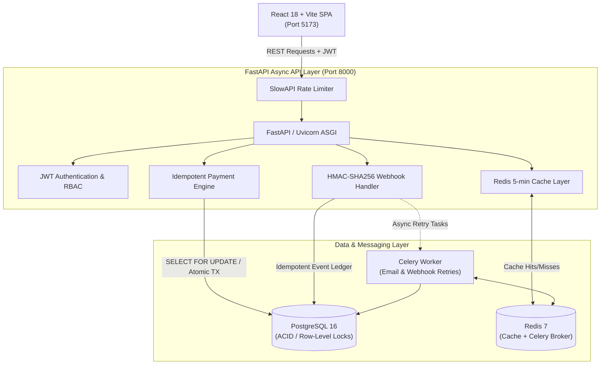

# EVE Healthcare — Diagnostic Booking & Payment Platform

[](https://fastapi.tiangolo.com)
[](https://python.org)
[](https://www.postgresql.org/)
[](https://redis.io/)
[](https://react.dev)
[](https://www.docker.com/)

A modern, production-grade diagnostic healthcare platform for discovering accredited diagnostic centres, selecting laboratory tests, scheduling appointments with AM/PM slot selection, processing simulated payment checkouts with idempotency guarantees, and handling payment webhook status transitions.

Built with an asynchronous **FastAPI** backend, **PostgreSQL** with SQLAlchemy 2.0 (asyncpg), **Redis** for distributed caching and rate-limiting, **Celery** for asynchronous webhook retries and email notifications, and a responsive **React/Vite** frontend built with a custom design system.

---

## Table of Contents

1. [System Architecture](#1-system-architecture)
2. [Quickstart (Docker Compose)](#2-quickstart-docker-compose)
3. [Pre-Seeded Demo Personas (1-Tap Fill)](#3-pre-seeded-demo-personas-1-tap-fill)
4. [User Workflow & Key Features](#4-user-workflow--key-features)
5. [Database Schema & Entity Relationships](#5-database-schema--entity-relationships)
6. [Booking & Payment State Machine](#6-booking--payment-state-machine)
7. [API Specification & Examples](#7-api-specification--examples)
8. [Idempotency & Concurrency Guarantees](#8-idempotency--concurrency-guarantees)
9. [Payment Webhook Implementation](#9-payment-webhook-implementation)
10. [Automated Test Suite (42 Tests)](#10-automated-test-suite-42-tests)
11. [Configuration & Environment Variables](#11-configuration--environment-variables)
12. [Architectural Decisions & Production Roadmap](#12-architectural-decisions--production-roadmap)

---

## 1. System Architecture



---

## 2. Quickstart (Docker Compose)

### Prerequisites

- [Docker Desktop](https://www.docker.com/products/docker-desktop/) (Compose v2+ enabled)
- Git

### Clone & Launch

```bash
# 1. Clone repository
git clone https://github.com/surajkumar11292/EVE_HealthCare.git
cd EVE_HealthCare

# 2. Launch all containers (Postgres, Redis, Web API, Celery Worker, Frontend)
docker compose up --build
```

### Deployed Services

| Service | Address | Description |
| :--- | :--- | :--- |
| **Frontend UI** | [http://localhost:5173](http://localhost:5173) | Single-clinic cart & diagnostic booking UI |
| **Backend REST API** | [http://localhost:8000](http://localhost:8000) | Core FastAPI ASGI application |
| **Interactive Docs (Swagger)** | [http://localhost:8000/docs](http://localhost:8000/docs) | OpenAPI interactive documentation |
| **Alternative Docs (ReDoc)** | [http://localhost:8000/redoc](http://localhost:8000/redoc) | Clean offline-ready API specification |
| **PostgreSQL** | `localhost:5432` | Relational storage (DB: `eve_healthcare`) |
| **Redis** | `localhost:6379` | Distributed cache and Celery broker |

### Seed Catalog Data (170+ Diagnostic Entities)

Run the high-density catalog seeder inside the running web container:

```bash
docker compose exec web python scripts/seed.py
```

This populates:
- **16 Premier Diagnostic Clinics** across 6 metropolitan cities (*Bangalore, Mumbai, Delhi, Hyderabad, Chennai, Pune*).
- **20 Clinical Diagnostic Tests** (*CBC, Lipid Profile, TSH, HbA1c, Vitamin D3/B12, KFT, LFT, etc.*).
- **133 Linked Centre-Test Offerings** with realistic city-specific pricing.
- **4 Demo Accounts** with pre-configured roles.
- **0 Pre-seeded Bookings**: Clean slate so all appointments in the table are created by your testing.

---

## 3. Pre-Seeded Demo Personas (1-Tap Fill)

The sign-in modal features **1-Tap Credentials Autofill**. Clicking any persona chip fills the email and password inputs without auto-submitting, allowing you to test authentication flows manually.

| Role | Persona Name | Email | Password | Clinical Specialization / Notes |
| :--- | :--- | :--- | :--- | :--- |
| **Patient #1** | **Suraj Kumar** | `patient@evehealthcare.com` | `Patient@123456` | Cardiology & Complete Blood Count |
| **Patient #2** | **Ananya Sharma** | `patient2@evehealthcare.com` | `Patient@123456` | Thyroid Stimulating Hormone & Vitamins |
| **Patient #3** | **Rajesh Patel** | `patient3@evehealthcare.com` | `Patient@123456` | Diabetic Profile & Renal Function |
| **Administrator** | **Dr. Rohan Mehra** | `admin@evehealthcare.com` | `Admin@123456` | Chief Lab Administrator (Platform View) |

---

## 4. User Workflow & Key Features

### 1. Two-Step Clinic-First Catalog Discovery
- **Step 1 (Find Clinics):** The user browses accredited diagnostic centres filtered by city (*Bangalore, Mumbai, Delhi, etc.*) or search query. Only clinics are displayed at this stage.
- **Step 2 (Select Clinic & View Tests):** Clicking a clinic navigates into that clinic's dedicated test offerings with prices, descriptions, and "Add to Cart" toggles.

### 2. Single-Clinic Cart & Conflict Resolution Modal
- **Single-Clinic Rule:** Diagnostic visits can only be scheduled at one laboratory at a time.
- **Conflict Guard:** If a patient adds tests from Clinic A (e.g., Apollo Diagnostics) and subsequently attempts to add a test from Clinic B (e.g., Apex Diagnostics), the `CartConflictModal` displays:
  - Option to **"Keep Current Cart"** (aborts addition).
  - Option to **"Clear & Add Test"** (flushes Clinic A items and initializes cart with Clinic B).

### 3. User-Isolated Cart Persistence
- Cart contents are isolated per user account in local storage (`eve_cart_items_user_<email>`).
- Switching between Admin, Suraj, Ananya, or Rajesh instantly restores that user's personal cart without state bleeding.

### 4. Healthcare Date & AM/PM Time Slot Selector
- Clean date selection using quick pills (*Tomorrow, In 2 Days, In 3 Days*) or custom calendar date.
- Explicitly labeled time slots divided into **Morning (AM)** (`08:00 AM`, `09:00 AM`, `10:00 AM`, `11:00 AM`) and **Afternoon/Evening (PM)** (`02:00 PM`, `03:30 PM`, `04:30 PM`, `06:00 PM`).
- Visual confirmation box displaying formatted appointment slot details.

### 5. Payment Checkout & Simulation Engine
- **Instant Success Mode:** Simulates successful authorization. Records booking as `CONFIRMED`, marks payment as `SUCCESS`, empties cart, and generates an official receipt with matching transaction reference.
- **Simulate Decline Mode:** Simulates an issuer card decline (`force_status: "FAILED"`). Preserves cart items so user can switch simulation mode and retry without re-entering data.
- **Appointment Cancellation:** Users and Admins can cancel any `PENDING` or `CONFIRMED` appointment from *My Appointments* prior to the appointment time.

---

## 5. Database Schema & Entity Relationships

```
┌──────────────┐       ┌────────────────┐       ┌──────────────────┐
│    users     │       │    centres     │       │ diagnostic_tests │
├──────────────┤       ├────────────────┤       ├──────────────────┤
│ id (PK, UUID)│       │ id (PK, UUID)  │       │ id (PK, UUID)    │
│ email (UQ)   │       │ name           │       │ name (UQ)        │
│ full_name    │       │ location       │       │ category         │
│ password     │       │ contact_number │       │ description      │
│ role (ENUM)  │       │ is_active      │       │ is_active        │
└──────┬───────┘       └───────┬────────┘       └────────┬─────────┘
       │                       │                         │
       │                       └────────────┬────────────┘
       │                                    ▼
       │                        ┌──────────────────────┐
       │                        │     centre_tests     │
       │                        ├──────────────────────┤
       │                        │ id (PK, UUID)        │
       │                        │ centre_id (FK)       │
       │                        │ test_id (FK)         │
       │                        │ price (NUMERIC 10,2) │
       │                        │ is_available (BOOL)  │
       │                        │ UNIQUE(centre, test) │
       │                        └──────────┬───────────┘
       ▼                                   ▼
┌──────────────────────────────────────────────────────┐
│                       bookings                       │
├──────────────────────────────────────────────────────┤
│ id (PK, UUID)                                        │
│ user_id (FK → users)                                 │
│ centre_test_id (FK → centre_tests)                   │
│ appointment_time (TIMESTAMPTZ)                       │
│ amount (NUMERIC 10,2 - snapshotted at booking)       │
│ status (ENUM: PENDING, CONFIRMED, CANCELLED, FAILED) │
│ notes (VARCHAR)                                      │
└──────────────────────────┬───────────────────────────┘
                           │ 1:1
                           ▼
┌──────────────────────────────────────────────────────┐
│                       payments                       │
├──────────────────────────────────────────────────────┤
│ id (PK, UUID)                                        │
│ booking_id (FK → bookings, UNIQUE)                   │
│ transaction_id (VARCHAR, UNIQUE)                     │
│ idempotency_key (VARCHAR, UNIQUE, INDEX)             │
│ provider (VARCHAR)                                   │
│ amount (NUMERIC 10,2)                                │
│ status (ENUM: PENDING, SUCCESS, FAILED)              │
│ failure_reason (VARCHAR, NULLABLE)                   │
└──────────────────────────────────────────────────────┘

┌──────────────────────────────────────────────────────┐
│                    webhook_events                    │
├──────────────────────────────────────────────────────┤
│ id (PK, UUID)                                        │
│ event_id (VARCHAR, UNIQUE, INDEX)                    │
│ event_type (VARCHAR)                                 │
│ payload (JSONB)                                      │
│ status (ENUM: PROCESSING, PROCESSED, FAILED)         │
│ retry_count (INTEGER)                                │
│ processed_at (TIMESTAMPTZ)                           │
└──────────────────────────────────────────────────────┘
```

---

## 6. Booking & Payment State Machine

```
              ┌────────────────────────────────────────────────┐
              │                   [PENDING]                    │
              │ (Created with snapshotted CentreTest price)    │
              └───────┬────────────────────┬─────────────────┬─┘
                      │                    │                 │
           Payment    │         Payment    │         User    │
           SUCCESS    │         FAILED     │         Cancel  │
                      ▼                    ▼                 ▼
              ┌───────────────┐    ┌───────────────┐ ┌───────────────┐
              │  [CONFIRMED]  │    │   [FAILED]    │ │  [CANCELLED]  │
              └───────┬───────┘    └───────────────┘ └───────────────┘
                      │ (Terminal)      (Terminal)
        Cancel before │
     appointment time │
                      ▼
              ┌───────────────┐
              │  [CANCELLED]  │
              └───────────────┘
                 (Terminal)
```

---

## 7. API Specification & Examples

**Base URL:** `http://localhost:8000/api/v1`

### 1. Authentication
```bash
# Login to obtain Bearer JWT
curl -X POST http://localhost:8000/api/v1/auth/login \
  -H "Content-Type: application/json" \
  -d '{"email": "patient@evehealthcare.com", "password": "Patient@123456"}'
```

### 2. Diagnostic Centres & Tests
```bash
# List clinics filtered by city
curl "http://localhost:8000/api/v1/centres/?location=Bangalore&size=10"

# Fetch clinic detail with offered tests and pricing (Cached in Redis)
curl http://localhost:8000/api/v1/centres/<centre_id>
```

### 3. Bookings
```bash
# Create booking for a test
curl -X POST http://localhost:8000/api/v1/bookings/ \
  -H "Authorization: Bearer <TOKEN>" \
  -H "Content-Type: application/json" \
  -d '{
    "centre_test_id": "<centre_test_uuid>",
    "appointment_time": "2026-10-02T10:00:00Z",
    "notes": "10 hours overnight fasting completed"
  }'

# Cancel confirmed or pending booking
curl -X POST http://localhost:8000/api/v1/bookings/<booking_id>/cancel \
  -H "Authorization: Bearer <TOKEN>" \
  -H "Content-Type: application/json" \
  -d '{"reason": "Rescheduled travel plans"}'
```

### 4. Payments
```bash
# Process simulated payment with client idempotency key
curl -X POST http://localhost:8000/api/v1/payments/ \
  -H "Authorization: Bearer <TOKEN>" \
  -H "Content-Type: application/json" \
  -d '{
    "booking_id": "<booking_uuid>",
    "idempotency_key": "pay_idem_9f82ab7c312489",
    "force_status": "SUCCESS"
  }'
```

---

## 8. Idempotency & Concurrency Guarantees

### Client-Side Idempotency (`POST /payments/`)
- Every payment request enforces a client-generated `idempotency_key`.
- The database enforces a `UNIQUE` constraint on `payments.idempotency_key`.
- Concurrent or replayed calls with the identical key catch `IntegrityError`, roll back atomically, and return the original payment record without double-charging or mutating state.

### Webhook Event Idempotency (`POST /payments/webhook/`)
- Incoming events check the `webhook_events` ledger using database row-level locking:
  ```python
  stmt = select(WebhookEvent).where(WebhookEvent.event_id == payload.event_id).with_for_update()
  ```
- If the event exists, the API returns `HTTP 200 OK` with `status: "already_processed"`.
- Prevents race conditions from parallel webhook deliveries, duplicate charges, or state corruption.

---

## 9. Payment Webhook Implementation

Dual-mounted at both `POST /payments/webhook/` (root specification) and `POST /api/v1/payments/webhook/`.

### Webhook Payload Schema
```json
{
  "event_id": "evt_sim_9238472398472",
  "event_type": "payment.success",
  "transaction_id": "TXN-8A3B9C1D0E4F",
  "booking_id": "a0eebc99-9c0b-4ef8-bb6d-6bb9bd380a11",
  "status": "SUCCESS",
  "failure_reason": null,
  "signature": "abcdef1234567890..."
}
```

### Verification Flow
1. **Cryptographic Validation:** Computes HMAC-SHA256 signature using `WEBHOOK_SECRET` over raw body or canonical payload `event_id:booking_id:status`. Rejects mismatched payloads with `HTTP 401 Unauthorized`.
2. **Idempotency Ledger:** Checks `webhook_events` with `SELECT FOR UPDATE`.
3. **State Mutation:** Updates `booking.status` to `CONFIRMED` or `FAILED`.
4. **Idempotent Return:** Always responds with `HTTP 200` to prevent gateway retry loops on terminal states.

---

## 10. Automated Test Suite (42 Tests)

The suite runs on an isolated in-memory SQLite database via `aiosqlite` and mock Redis fixtures, requiring zero external dependencies:

```bash
# Execute test suite inside Docker
docker compose exec web pytest tests/ -v
```

### Test Coverage Breakdown

| Test Module | Coverage Scope | Status |
| :--- | :--- | :--- |
| `tests/test_auth.py` | User registration, password complexity, login, JWT validation, profile access | **Passed (9/9)** |
| `tests/test_centres.py` | Centre listing, city filters, RBAC guards, test linkage, soft deletion | **Passed (7/7)** |
| `tests/test_bookings.py` | Appointment creation, past date rejection, isolation, cancellation rules | **Passed (7/7)** |
| `tests/test_payments.py` | Payment creation, success/failure transitions, idempotency replay, conflict detection | **Passed (8/8)** |
| `tests/test_webhooks.py` | HMAC verification, duplicate event deduplication, concurrent deliveries, root path | **Passed (7/7)** |
| `tests/test_rate_limit.py` | Client IP extraction, SlowAPI header injection, HTTP 429 throttling | **Passed (2/2)** |
| `tests/test_celery_tasks.py` | Async task dispatch, email notification mocking, webhook retry task logic | **Passed (2/2)** |
| **Total** | **Comprehensive end-to-end integration and unit coverage** | **42 / 42 Passed** |

---

## 11. Configuration & Environment Variables

All variables are pre-configured in `docker-compose.yml` for local development:

| Variable | Default (Local Docker) | Description |
| :--- | :--- | :--- |
| `APP_ENV` | `development` | Runtime environment (`development` / `production`) |
| `SECRET_KEY` | `super_secret_development_jwt_key_...` | HS256 secret key for signing JWT tokens |
| `DATABASE_URL` | `postgresql+asyncpg://postgres:postgres@db:5432/eve_healthcare` | Async PostgreSQL connection string |
| `REDIS_URL` | `redis://redis:6379/0` | Redis connection URL for cache and broker |
| `WEBHOOK_SECRET` | `super_secret_webhook_signature_key` | Secret key for payment webhook HMAC validation |
| `RATE_LIMIT_DEFAULT` | `60/minute` | Default per-IP endpoint rate limit |
| `RATE_LIMIT_AUTH` | `10/minute` | Rate limit for `/auth/signup` and `/auth/login` |
| `RATE_LIMIT_PAYMENT` | `20/minute` | Rate limit for `/payments/` creation |
| `RATE_LIMIT_WEBHOOK` | `100/minute` | Rate limit for `/payments/webhook/` ingestion |

---

## 12. Architectural Decisions & Production Roadmap

### Key Design Decisions
1. **Price Snapshotting:** The price stored on `bookings.amount` is frozen at the moment of booking creation from `centre_tests.price`. Subsequent laboratory price adjustments do not impact existing bookings.
2. **Soft Deletion of Facilities:** Clinics are deactivated (`is_active = false`) rather than hard deleted, ensuring foreign-key integrity for historical appointments.
3. **Database-Level Idempotency:** Critical financial workflows rely on ACID transaction isolation and unique database constraints rather than in-memory caches, guaranteeing correctness across scaled worker processes.

### Production Enhancements with More Time
- **Slot Capacity & Concurrency Locking:** Introduce time slot booking quotas to prevent overlapping bookings for the same phlebotomist.
- **Refresh Token Rotation:** Upgrade auth flow from single access tokens to short-lived access tokens with rotating refresh tokens stored in secure `HttpOnly` cookies.
- **Live Payment Gateway Adapter:** Replace simulated card processing with Razorpay / Stripe webhook event adapters using the existing service interface.
- **Prometheus & OpenTelemetry:** Export distributed tracing spans and metrics for P99 latency and queue depth monitoring.
