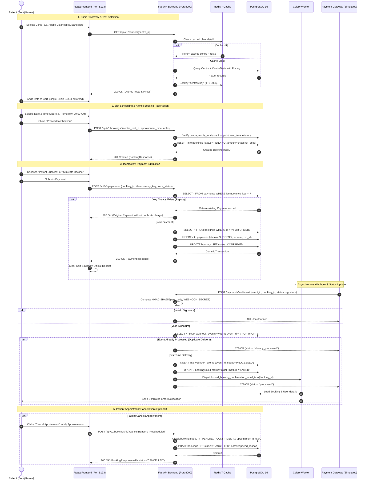

# EVE Healthcare — Diagnostic Booking & Payment Platform

[](https://fastapi.tiangolo.com)
[](https://python.org)
[](https://www.postgresql.org/)
[](https://redis.io/)
[](https://react.dev)
[](https://www.docker.com/)
[](https://pytest.org)

A modern, production-grade diagnostic healthcare platform for discovering accredited diagnostic centres, selecting laboratory tests, scheduling appointments with AM/PM slot selection, processing simulated payment checkouts with idempotency guarantees, and handling payment webhook status transitions.

Built with an asynchronous **FastAPI** backend, **PostgreSQL** with SQLAlchemy 2.0 (asyncpg), **Redis** for distributed caching and rate-limiting, **Celery** for asynchronous webhook retries and email notifications, and a responsive **React/Vite** frontend built with a custom healthcare design system.

---

## Table of Contents

1. [Quickstart (Docker Compose)](#1-quickstart-docker-compose)
2. [Pre-Seeded Demo Personas (1-Tap Fill)](#2-pre-seeded-demo-personas-1-tap-fill)
3. [Visual Codebase Architecture](#3-visual-codebase-architecture)
4. [Visual System Architecture & Flow](#4-visual-system-architecture--flow)
5. [End-to-End Workflow Dataflow (Sequence Diagram)](#5-end-to-end-workflow-dataflow-sequence-diagram)
6. [User Workflow & Key Features](#6-user-workflow--key-features)
7. [Database Schema & Entity Relationships](#7-database-schema--entity-relationships)
8. [Booking & Payment State Machine](#8-booking--payment-state-machine)
9. [API Specification & cURL Examples](#9-api-specification--curl-examples)
10. [Idempotency & Concurrency Guarantees](#10-idempotency--concurrency-guarantees)
11. [Payment Webhook Implementation](#11-payment-webhook-implementation)
12. [Automated Test Suite (42 Tests)](#12-automated-test-suite-42-tests)
13. [Configuration & Environment Variables](#13-configuration--environment-variables)
14. [Architectural Decisions & Production Roadmap](#14-architectural-decisions--production-roadmap)
15. [Assignment Submission Copy-Paste Block](#15-assignment-submission-copy-paste-block)

---

## 1. Quickstart (Docker Compose)

### Prerequisites

- [Docker Desktop](https://www.docker.com/products/docker-desktop/) (Compose v2+ enabled)
- Git

### Clone & Launch

```bash
# 1. Clone repository
git clone https://github.com/surajkumar11292/EVE_HealthCare.git
cd EVE_HealthCare

# 2. Launch all services (Postgres, Redis, Web API, Celery Worker, Frontend)
docker compose up --build
```

### Deployed Services

| Service | Address | Description |
| :--- | :--- | :--- |
| **Frontend UI** | [http://localhost:5173](http://localhost:5173) | Single-clinic cart & diagnostic booking UI |
| **Backend REST API** | [http://localhost:8000](http://localhost:8000) | Core FastAPI ASGI application |
| **Interactive Docs (Swagger)** | [http://localhost:8000/docs](http://localhost:8000/docs) | OpenAPI interactive documentation |
| **Alternative Docs (ReDoc)** | [http://localhost:8000/redoc](http://localhost:8000/redoc) | Offline-ready API specification |
| **PostgreSQL** | `localhost:5432` | Relational storage (Database: `eve_healthcare`) |
| **Redis** | `localhost:6379` | Distributed cache and Celery broker |

### Seed Catalog Data (170+ Diagnostic Entities)

Run the high-density catalog seeder inside the running web container in a separate terminal:

```bash
docker compose exec web python scripts/seed.py
```

This populates:
- **16 Premier Diagnostic Clinics** across 6 metropolitan cities (*Bangalore, Mumbai, Delhi, Hyderabad, Chennai, Pune*).
- **20 Clinical Diagnostic Tests** (*CBC, Lipid Profile, TSH, HbA1c, Vitamin D3/B12, KFT, LFT, etc.*).
- **133 Linked Centre-Test Offerings** with realistic city-specific pricing.
- **4 Demo Accounts** with pre-configured roles (1 Admin + 3 Patients).
- **0 Pre-seeded Bookings**: Clean slate so all appointments in the table are created by your testing.

---

## 2. Pre-Seeded Demo Personas (1-Tap Fill)

The frontend sign-in modal features **1-Tap Credentials Autofill**. Clicking any persona chip automatically populates the email and password inputs without auto-submitting, allowing you to test authentication flows manually.

| Role | Persona Name | Email | Password | Clinical Specialization / Notes |
| :--- | :--- | :--- | :--- | :--- |
| **Patient #1** | **Suraj Kumar** | `patient@evehealthcare.com` | `Patient@123456` | Cardiology & Complete Blood Count (CBC) |
| **Patient #2** | **Ananya Sharma** | `patient2@evehealthcare.com` | `Patient@123456` | Thyroid Stimulating Hormone (TSH) & Vitamins |
| **Patient #3** | **Rajesh Patel** | `patient3@evehealthcare.com` | `Patient@123456` | Diabetic Profile & Renal Function (KFT) |
| **Administrator** | **Dr. Rohan Mehra** | `admin@evehealthcare.com` | `Admin@123456` | Chief Lab Administrator (Platform View & Facility Management) |

> [!TIP]
> **User-Isolated Cart:** Each patient account maintains a completely independent cart in local storage (`eve_cart_items_user_<email>`). Switching between Suraj, Ananya, Rajesh, or Dr. Rohan Mehra instantly restores that user's personal cart without state leakage.

---

## 3. Visual Codebase Architecture

```
d:\EVE_HealthCare
├── alembic/                         # Database schema migrations
│   ├── env.py                       # Async SQLAlchemy migration runtime
│   └── versions/
│       └── 0001_initial_schema.py   # Initial DDL: users, centres, tests, bookings, payments, webhooks
├── app/                             # Core FastAPI application package
│   ├── api/
│   │   └── v1/                      # Versioned REST API layer
│   │       ├── auth.py              # Signup, login, JWT token issuance (/auth)
│   │       ├── centres.py           # Clinic catalog, search, test linkage (/centres)
│   │       ├── tests.py             # Diagnostic test definitions (/tests)
│   │       ├── bookings.py          # Scheduling, reservation, cancellation (/bookings)
│   │       ├── payments.py          # Idempotent payments & dual webhook (/payments)
│   │       └── router.py            # Unified V1 APIRouter aggregator
│   ├── core/                        # Application infrastructure & cross-cutting concerns
│   │   ├── config.py                # Pydantic v2 BaseSettings (env, credentials, secrets)
│   │   ├── security.py              # Passlib bcrypt hashing, PyJWT encoding/decoding
│   │   ├── rate_limit.py            # SlowAPI Redis/memory rate limiter & IP resolution
│   │   └── logging.py               # Structlog structured JSON logger with X-Request-ID
│   ├── db/                          # Database connection & lifecycle
│   │   ├── base.py                  # SQLAlchemy DeclarativeBase with UUIDMixin & TimestampMixin
│   │   ├── session.py               # AsyncEngine and AsyncSessionLocal factory (asyncpg)
│   │   └── seed.py                  # Fallback in-app database bootstrapper
│   ├── models/                      # SQLAlchemy 2.0 ORM domain entities
│   │   ├── user.py                  # User entity & UserRole enum (ADMIN, PATIENT)
│   │   ├── centre.py                # Diagnostic centre facility model
│   │   ├── test.py                  # Diagnostic laboratory test definition
│   │   ├── centre_test.py           # Centre-Test m2m link with priced offerings
│   │   ├── booking.py               # Booking entity with snapshot pricing & status FSM
│   │   ├── payment.py               # Payment transaction ledger with idempotency_key
│   │   └── webhook_event.py         # Webhook event ledger with status (PROCESSING, PROCESSED, DUPLICATE, FAILED)
│   ├── schemas/                     # Pydantic request/response validation schemas
│   │   ├── auth.py                  # UserLogin, UserSignup, TokenResponse
│   │   ├── centre.py                # CentreCreate, CentreResponse, CentreWithTestsResponse
│   │   ├── test.py                  # TestCreate, TestResponse
│   │   ├── booking.py               # BookingCreateRequest, BookingCancelRequest, BookingResponse
│   │   └── payment.py               # PaymentCreateRequest, PaymentResponse, WebhookPayload, WebhookResponse
│   ├── services/                    # Business logic & transaction boundaries
│   │   ├── booking_service.py       # Atomic booking creation, snapshot pricing, cancellation rules
│   │   ├── payment_service.py       # Idempotent payment processing, HMAC verification, webhook ledger
│   │   └── cache_service.py         # Redis caching layer for high-throughput centre listings
│   ├── tasks/                       # Celery asynchronous background tasks
│   │   ├── celery_app.py            # Celery instance configuration with Redis broker
│   │   ├── email_tasks.py           # Asynchronous booking confirmation email simulation
│   │   └── webhook_tasks.py         # Exponential backoff retry handler for failed webhooks
│   └── main.py                      # Application entrypoint, lifespan, CORS, error handlers, root endpoints
├── frontend/                        # React 18 + Vite Single Page Application
│   ├── src/
│   │   ├── components/              # UI components
│   │   │   ├── Navbar.jsx           # Top navigation bar, role indicators, quick persona switcher
│   │   │   ├── CatalogView.jsx      # 2-Step clinic discovery & test offerings catalog
│   │   │   ├── CartView.jsx         # Single-clinic cart, AM/PM slot selector, payment simulation, printable receipt
│   │   │   ├── CartConflictModal.jsx# Conflict dialog when adding tests from a different clinic
│   │   │   ├── BookingsView.jsx     # Patient appointments table, cancel button, status badges
│   │   │   ├── PaymentsView.jsx     # Financial audit ledger, transaction IDs, payment drawer
│   │   │   ├── WebhookSandbox.jsx   # Interactive cryptographic HMAC-SHA256 webhook testing tool
│   │   │   ├── AuthModal.jsx        # Sign-in/registration modal with 1-Tap persona chips
│   │   │   └── AddCentreModal.jsx   # Admin modal for registering new diagnostic facilities
│   │   ├── context/                 # Global React State Contexts
│   │   │   ├── AuthContext.jsx      # User authentication state, token storage, switchPersona
│   │   │   └── CartContext.jsx      # User-isolated cart state, single-clinic conflict validation
│   │   ├── services/
│   │   │   └── api.js               # Centralized Axios client with JWT interceptor & error handling
│   │   ├── App.jsx                  # Root view routing & navigation switcher
│   │   ├── index.css                # Healthcare design system (warm beige aesthetic, typography, cards)
│   │   └── main.jsx                 # React DOM mount point
│   ├── package.json                 # Frontend dependencies (Lucide icons, Axios, Vite)
│   └── vite.config.js               # Vite development server configuration (Port 5173)
├── scripts/                         # Automation & maintenance scripts
│   ├── seed.py                      # 170+ record database seeder (16 centres, 20 tests, 133 links, 4 users)
│   └── clear_appointments.py        # Utility script to flush test bookings for clean evaluation
├── tests/                           # Pytest async test suite (42/42 Passing)
│   ├── conftest.py                  # Isolated SQLite in-memory engine, mock Redis, client fixtures
│   ├── test_auth.py                 # Authentication, password complexity, JWT validation (9 tests)
│   ├── test_centres.py              # Centre discovery, city filters, RBAC guards, test linkage (7 tests)
│   ├── test_bookings.py             # Appointment creation, future date validation, cancellation (7 tests)
│   ├── test_payments.py             # Payment creation, idempotency replay, conflict detection (8 tests)
│   ├── test_webhooks.py             # HMAC validation, event ledger deduplication, root endpoint (7 tests)
│   ├── test_rate_limit.py           # SlowAPI rate limiting & HTTP 429 throttling (2 tests)
│   └── test_celery_tasks.py         # Background task dispatch & mocked worker logic (2 tests)
├── docker-compose.yml               # Multi-container orchestration (web, worker, redis, db, frontend)
├── Dockerfile                       # Python 3.11 slim production-ready image
├── requirements.txt                 # Backend Python dependencies
├── pytest.ini                       # Pytest configuration with asyncio mode auto
└── README.md                        # Senior-developer architectural documentation
```

---

## 4. Visual System Architecture & Flow

```
┌────────────────────────────────────────────────────────────────────────────────────────┐
│                                 PRESENTATION LAYER                                     │
│  React 18 + Vite SPA (Port 5173)                                                       │
│  ├── Navbar & Role Guard (Dr. Rohan Mehra [Admin] / Suraj Kumar [Patient])             │
│  ├── 2-Step Catalog View (Accredited Clinics ➔ Offered Lab Tests)                     │
│  ├── Single-Clinic Enforced Cart (User-Isolated Storage: LocalStorage per Email)       │
│  ├── AM/PM Appointment Slot Selector (Quick Pills + Modal Confirmation)                │
│  ├── Idempotent Payment Simulator (Success Mode vs. Simulated Decline Mode)            │
│  └── Interactive Cryptographic Webhook Sandbox (HMAC-SHA256 Payload Generator)         │
└────────────────────────────────────────┬───────────────────────────────────────────────┘
                                         │ REST (JSON) + Bearer JWT
                                         ▼
┌────────────────────────────────────────────────────────────────────────────────────────┐
│                              API GATEWAY & SERVICE LAYER                               │
│  FastAPI ASGI Server (Uvicorn / Port 8000)                                             │
│  ├── Middleware Pipeline                                                               │
│  │   ├── Structlog Request Tracer (Generates & Injects X-Request-ID)                   │
│  │   ├── SlowAPI Rate Limiter (Default: 60/min, Auth: 10/min, Payments: 20/min)       │
│  │   └── CORS Middleware (Configured origins, credentials allowed)                     │
│  ├── Authentication & RBAC Engine (PyJWT, Passlib Bcrypt, Role-Based Access Control)    │
│  ├── Cache Proxy Service (Redis-backed 5-minute cache with automatic invalidation)    │
│  └── Core Business Services                                                            │
│      ├── BookingService (Snapshot pricing, date validation, state transitions)         │
│      ├── PaymentService (Idempotency key uniqueness, atomic state updates)             │
│      └── WebhookService (HMAC-SHA256 signature verification, event ledger)             │
└───────────────────┬────────────────────────────────┬───────────────────┬───────────────┘
                    │                                │                   │
       Read/Write   ▼                   Queue Tasks  ▼        Cache/Lock ▼
┌──────────────────────────────┐ ┌──────────────────────────┐ ┌──────────────────────────┐
│       POSTGRESQL 16          │ │     CELERY WORKER        │ │         REDIS 7          │
│  Relational Storage          │ │  Asynchronous Processing │ │  Cache & Message Broker  │
│  ├── users (UUID, Unique)    │ │  ├── Email Notifications │ │  ├── GET /centres cache   │
│  ├── centres (Soft delete)   │ │  ├── Webhook Retries     │ │  ├── Celery Task Queue   │
│  ├── diagnostic_tests        │ │  └── Dead Letter Logging │ │  └── Distributed Locks   │
│  ├── centre_tests (Price)    │ └─────────────┬────────────┘ └──────────────────────────┘
│  ├── bookings (Snapshot, FSM)│               │
│  ├── payments (Idempotency)  │ ◄─────────────┘
│  └── webhook_events (Ledger) │ (Updates Event Status)
└──────────────────────────────┘
```

---

## 5. End-to-End Workflow Dataflow (Sequence Diagram)

The following sequence diagram illustrates the complete diagnostic booking, payment simulation, and webhook processing lifecycle:



---

## 6. User Workflow & Key Features

### 1. Two-Step Clinic-First Catalog Discovery
- **Step 1 (Find Clinics):** The user browses accredited diagnostic centres filtered by city (*Bangalore, Mumbai, Delhi, Hyderabad, Chennai, Pune*) or search query. Only clinics are displayed at this stage.
- **Step 2 (Select Clinic & View Tests):** Clicking a clinic navigates into that clinic's dedicated test offerings with prices, descriptions, and "Add to Cart" toggles.

### 2. Single-Clinic Cart & Conflict Resolution Modal
- **Single-Clinic Rule:** Diagnostic visits can only be scheduled at one laboratory at a time.
- **Conflict Guard:** If a patient adds tests from Clinic A (e.g., Apollo Diagnostics) and subsequently attempts to add a test from Clinic B (e.g., Apex Diagnostics), the `CartConflictModal` displays:
  - Option to **"Keep Current Cart"** (aborts addition).
  - Option to **"Clear & Add Test"** (flushes Clinic A items and initializes cart with Clinic B).

### 3. User-Isolated Cart Persistence
- Cart contents are isolated per user account in local storage (`eve_cart_items_user_<email>`).
- Switching between Dr. Rohan Mehra, Suraj Kumar, Ananya Sharma, or Rajesh Patel instantly restores that user's personal cart without state bleeding.

### 4. Healthcare Date & AM/PM Time Slot Selector
- Clean date selection using quick pills (*Tomorrow, In 2 Days, In 3 Days*) or custom calendar date.
- Explicitly labeled time slots divided into **Morning (AM)** (`08:00 AM`, `09:00 AM`, `10:00 AM`, `11:00 AM`) and **Afternoon/Evening (PM)** (`02:00 PM`, `03:30 PM`, `04:30 PM`, `06:00 PM`).
- Visual confirmation box displaying formatted appointment slot details.

### 5. Payment Checkout & Simulation Engine
- **Instant Success Mode:** Simulates successful authorization. Records booking as `CONFIRMED`, marks payment as `SUCCESS`, empties cart, and generates an official receipt with matching transaction reference.
- **Simulate Decline Mode:** Simulates an issuer card decline (`force_status: "FAILED"`). Preserves cart items so user can switch simulation mode and retry without re-entering data.
- **Appointment Cancellation:** Users and Admins can cancel any `PENDING` or `CONFIRMED` appointment from *My Appointments* prior to the appointment time.

---

## 7. Database Schema & Entity Relationships

```
┌────────────────────────────────────────────────────────┐
│                        users                           │
├────────────────────────────────────────────────────────┤
│ id (PK, UUID)                                          │
│ email (VARCHAR 255, UNIQUE, INDEX)                     │
│ full_name (VARCHAR 255)                                │
│ hashed_password (VARCHAR 255)                          │
│ role (ENUM: 'PATIENT', 'ADMIN')                        │
│ is_active (BOOLEAN, default: true)                     │
│ created_at (TIMESTAMPTZ), updated_at (TIMESTAMPTZ)     │
└───────────┬────────────────────────────────────────────┘
            │ 1:N
            ▼
┌────────────────────────────────────────────────────────┐
│                       bookings                         │
├────────────────────────────────────────────────────────┤
│ id (PK, UUID)                                          │
│ user_id (FK → users.id, ON DELETE CASCADE)             │
│ centre_test_id (FK → centre_tests.id, RESTRICT)        │
│ appointment_time (TIMESTAMPTZ, INDEX)                  │
│ amount (NUMERIC 10,2 - snapshotted at booking)         │
│ status (ENUM: 'PENDING','CONFIRMED','FAILED','CANCEL') │
│ notes (TEXT, NULLABLE)                                 │
│ created_at (TIMESTAMPTZ), updated_at (TIMESTAMPTZ)     │
└───────────┬────────────────────────────────────────────┘
            │ 1:1
            ▼
┌────────────────────────────────────────────────────────┐
│                       payments                         │
├────────────────────────────────────────────────────────┤
│ id (PK, UUID)                                          │
│ booking_id (FK → bookings.id, UNIQUE, INDEX)           │
│ transaction_id (VARCHAR 100, UNIQUE, INDEX)            │
│ idempotency_key (VARCHAR 255, UNIQUE, INDEX)           │
│ provider (VARCHAR 50, default: 'SIMULATED')            │
│ amount (NUMERIC 10,2)                                  │
│ status (ENUM: 'PENDING', 'SUCCESS', 'FAILED')          │
│ failure_reason (TEXT, NULLABLE)                        │
│ created_at (TIMESTAMPTZ), updated_at (TIMESTAMPTZ)     │
└────────────────────────────────────────────────────────┘

┌────────────────────────┐              ┌────────────────────────┐
│        centres         │              │    diagnostic_tests    │
├────────────────────────┤              ├────────────────────────┤
│ id (PK, UUID)          │              │ id (PK, UUID)          │
│ name (VARCHAR 255)     │              │ name (VARCHAR 255, UQ) │
│ location (VARCHAR 255) │              │ category (VARCHAR 100) │
│ contact_number (VARCHAR│              │ description (TEXT)     │
│ is_active (BOOLEAN)    │              │ is_active (BOOLEAN)    │
└───────────┬────────────┘              └───────────┬────────────┘
            │ 1:N                                   │ 1:N
            └───────────────────┬───────────────────┘
                                ▼
┌────────────────────────────────────────────────────────┐
│                     centre_tests                       │
├────────────────────────────────────────────────────────┤
│ id (PK, UUID)                                          │
│ centre_id (FK → centres.id, ON DELETE CASCADE)         │
│ test_id (FK → diagnostic_tests.id, ON DELETE CASCADE)  │
│ price (NUMERIC 10,2)                                   │
│ is_available (BOOLEAN, default: true)                  │
│ UNIQUE(centre_id, test_id)                             │
└────────────────────────────────────────────────────────┘

┌────────────────────────────────────────────────────────┐
│                    webhook_events                      │
├────────────────────────────────────────────────────────┤
│ id (PK, UUID)                                          │
│ event_id (VARCHAR 255, UNIQUE, INDEX)                  │
│ event_type (VARCHAR 100)                               │
│ payload (JSONB)                                        │
│ status (ENUM: 'PROCESSING','PROCESSED','DUP','FAILED') │
│ retry_count (INTEGER, default: 0)                      │
│ processed_at (TIMESTAMPTZ, NULLABLE)                   │
│ created_at (TIMESTAMPTZ), updated_at (TIMESTAMPTZ)     │
└────────────────────────────────────────────────────────┘
```

---

## 8. Booking & Payment State Machine

The platform implements a strict Finite State Machine (FSM) to ensure financial and appointment integrity:

```
               ┌────────────────────────────────────────────────┐
               │                   [PENDING]                    │
               │ (Created with snapshotted CentreTest price)    │
               └───────┬────────────────────┬─────────────────┬─┘
                       │                    │                 │
            Payment    │         Payment    │         User    │
            SUCCESS    │         FAILED     │         Cancel  │
                       ▼                    ▼                 ▼
               ┌───────────────┐    ┌───────────────┐ ┌───────────────┐
               │  [CONFIRMED]  │    │   [FAILED]    │ │  [CANCELLED]  │
               └───────┬───────┘    └───────────────┘ └───────────────┘
                       │ (Terminal)      (Terminal)       (Terminal)
         Cancel before │
      appointment time │
                       ▼
               ┌───────────────┐
               │  [CANCELLED]  │
               └───────────────┘
                  (Terminal)
```

### Transition Invariants
- `PENDING ➔ CONFIRMED`: Triggered when payment succeeds (`POST /payments/` or webhook `payment.success`).
- `PENDING ➔ FAILED`: Triggered when payment simulation fails (`force_status: "FAILED"` or webhook `payment.failed`).
- `PENDING ➔ CANCELLED`: Triggered when patient or admin cancels a pending booking.
- `CONFIRMED ➔ CANCELLED`: Permitted only if the appointment date is strictly in the future.
- `FAILED ➔ CANCELLED`: **Forbidden** (returns `HTTP 409 Conflict`).
- `CANCELLED ➔ ANY`: **Terminal state**; cannot be modified.

---

## 9. API Specification & cURL Examples

**Base URL:** `http://localhost:8000/api/v1`

### 1. Authentication (`/auth`)

#### User Login
```bash
curl -X POST http://localhost:8000/api/v1/auth/login \
  -H "Content-Type: application/json" \
  -d '{
    "email": "patient@evehealthcare.com",
    "password": "Patient@123456"
  }'
```

#### User Registration
```bash
curl -X POST http://localhost:8000/api/v1/auth/signup \
  -H "Content-Type: application/json" \
  -d '{
    "email": "suraj.kumar@example.com",
    "password": "Patient@123456",
    "full_name": "Suraj Kumar"
  }'
```

#### Current User Profile
```bash
curl -X GET http://localhost:8000/api/v1/auth/me \
  -H "Authorization: Bearer <ACCESS_TOKEN>"
```

---

### 2. Diagnostic Centres & Tests (`/centres`, `/tests`)

#### List Diagnostic Centres (Paginated & Filtered)
```bash
curl -X GET "http://localhost:8000/api/v1/centres/?location=Bangalore&size=10"
```

#### Get Centre Details with Test Pricing (Cached)
```bash
curl -X GET http://localhost:8000/api/v1/centres/<CENTRE_UUID>
```

#### Create New Centre (Admin Only)
```bash
curl -X POST http://localhost:8000/api/v1/centres/ \
  -H "Authorization: Bearer <ADMIN_TOKEN>" \
  -H "Content-Type: application/json" \
  -d '{
    "name": "Manipal Diagnostics",
    "location": "Bangalore",
    "contact_number": "+91-80-2502-4444"
  }'
```

#### Link Test to Centre with Pricing (Admin Only)
```bash
curl -X POST http://localhost:8000/api/v1/centres/<CENTRE_UUID>/tests \
  -H "Authorization: Bearer <ADMIN_TOKEN>" \
  -H "Content-Type: application/json" \
  -d '{
    "test_id": "<TEST_UUID>",
    "price": 650.00,
    "is_available": true
  }'
```

---

### 3. Bookings (`/bookings`)

#### Create Diagnostic Booking
```bash
curl -X POST http://localhost:8000/api/v1/bookings/ \
  -H "Authorization: Bearer <PATIENT_TOKEN>" \
  -H "Content-Type: application/json" \
  -d '{
    "centre_test_id": "<CENTRE_TEST_UUID>",
    "appointment_time": "2026-10-02T10:00:00Z",
    "notes": "Fasting blood sample required"
  }'
```

#### List Bookings (Patient sees own; Admin sees all)
```bash
curl -X GET http://localhost:8000/api/v1/bookings/ \
  -H "Authorization: Bearer <PATIENT_TOKEN>"
```

#### Cancel Booking
```bash
curl -X POST http://localhost:8000/api/v1/bookings/<BOOKING_UUID>/cancel \
  -H "Authorization: Bearer <PATIENT_TOKEN>" \
  -H "Content-Type: application/json" \
  -d '{
    "reason": "Rescheduled travel plans"
  }'
```

---

### 4. Payments (`/payments`)

Both `POST /api/v1/payments/` and root `POST /payments/` are supported.

#### Initiate Payment with Idempotency Key
```bash
curl -X POST http://localhost:8000/api/v1/payments/ \
  -H "Authorization: Bearer <PATIENT_TOKEN>" \
  -H "Content-Type: application/json" \
  -d '{
    "booking_id": "<BOOKING_UUID>",
    "idempotency_key": "pay_idem_9f82ab7c312489",
    "force_status": "SUCCESS"
  }'
```

---

## 10. Idempotency & Concurrency Guarantees

### Client-Side Idempotency (`POST /payments/`)
- Every payment request enforces a client-provided `idempotency_key` (minimum 8 characters).
- The database enforces a `UNIQUE` constraint on `payments.idempotency_key`.
- Concurrent or replayed calls with the identical key catch `IntegrityError`, roll back atomically, and return the original payment record without double-charging or mutating state.

### Webhook Event Deduplication (`POST /payments/webhook/`)
- Incoming events check the `webhook_events` ledger using database row-level locking:
  ```python
  stmt = select(WebhookEvent).where(WebhookEvent.event_id == payload.event_id).with_for_update()
  ```
- If the event exists, the API returns `HTTP 200 OK` with `status: "already_processed"`.
- Prevents race conditions from parallel webhook deliveries, duplicate charges, or state corruption.

---

## 11. Payment Webhook Implementation

Dual-mounted at both `POST /payments/webhook/` (root specification) and `POST /api/v1/payments/webhook/`.

### Webhook Payload Schema
```json
{
  "event_id": "evt_sim_9238472398472",
  "event_type": "payment.success",
  "transaction_id": "TXN-8A3B9C1D0E4F",
  "booking_id": "a0eebc99-9c0b-4ef8-bb6d-6bb9bd380a11",
  "status": "SUCCESS",
  "failure_reason": null,
  "signature": "abcdef1234567890abcdef1234567890abcdef1234567890abcdef1234567890"
}
```

### Verification Flow
1. **Cryptographic Validation:** Computes HMAC-SHA256 signature using `WEBHOOK_SECRET` over raw request body or payload signature field. Rejects mismatched payloads with `HTTP 401 Unauthorized`.
2. **Idempotency Ledger:** Checks `webhook_events` with `SELECT FOR UPDATE`.
3. **State Mutation:** Updates `booking.status` to `CONFIRMED` or `FAILED`.
4. **Idempotent Return:** Always responds with `HTTP 200` to prevent gateway retry loops on terminal states.

---

## 12. Automated Test Suite (42 Tests)

The suite runs on an isolated in-memory SQLite database via `aiosqlite` and mock Redis fixtures, requiring zero external dependencies:

```bash
# Execute test suite inside Docker web container
docker compose exec web pytest tests/ -v
```

### Test Coverage Breakdown

| Test Module | Coverage Scope | Status |
| :--- | :--- | :--- |
| `tests/test_auth.py` | User registration, password complexity, login, JWT validation, profile access | **Passed (9/9)** |
| `tests/test_centres.py` | Centre listing, city filters, RBAC guards, test linkage, soft deletion | **Passed (7/7)** |
| `tests/test_bookings.py` | Appointment creation, past date rejection, isolation, cancellation rules | **Passed (7/7)** |
| `tests/test_payments.py` | Payment creation, success/failure transitions, idempotency replay, conflict detection | **Passed (8/8)** |
| `tests/test_webhooks.py` | HMAC verification, duplicate event deduplication, concurrent deliveries, root path | **Passed (7/7)** |
| `tests/test_rate_limit.py` | Client IP extraction, SlowAPI header injection, HTTP 429 throttling | **Passed (2/2)** |
| `tests/test_celery_tasks.py` | Async task dispatch, email notification mocking, webhook retry task logic | **Passed (2/2)** |
| **Total** | **Comprehensive end-to-end integration and unit coverage** | **42 / 42 Passed** |

---

## 13. Configuration & Environment Variables

All variables are pre-configured in `docker-compose.yml` for local development:

| Variable | Default (Local Docker) | Description |
| :--- | :--- | :--- |
| `APP_ENV` | `development` | Runtime environment (`development` / `production`) |
| `SECRET_KEY` | `super_secret_development_jwt_key_...` | HS256 secret key for signing JWT tokens |
| `DATABASE_URL` | `postgresql+asyncpg://postgres:postgres@db:5432/eve_healthcare` | Async PostgreSQL connection string |
| `REDIS_URL` | `redis://redis:6379/0` | Redis connection URL for cache and broker |
| `WEBHOOK_SECRET` | `super_secret_webhook_signature_key` | Secret key for payment webhook HMAC validation |
| `RATE_LIMIT_DEFAULT` | `60/minute` | Default per-IP endpoint rate limit |
| `RATE_LIMIT_AUTH` | `10/minute` | Rate limit for `/auth/signup` and `/auth/login` |
| `RATE_LIMIT_PAYMENT` | `20/minute` | Rate limit for `/payments/` creation |
| `RATE_LIMIT_WEBHOOK` | `100/minute` | Rate limit for `/payments/webhook/` ingestion |

---

## 14. Architectural Decisions & Production Roadmap

### Key Design Decisions
1. **Price Snapshotting:** The price stored on `bookings.amount` is frozen at the moment of booking creation from `centre_tests.price`. Subsequent laboratory price adjustments do not impact existing bookings.
2. **Soft Deletion of Facilities:** Clinics are deactivated (`is_active = false`) rather than hard deleted, ensuring foreign-key integrity for historical appointments.
3. **Database-Level Idempotency:** Critical financial workflows rely on ACID transaction isolation and unique database constraints rather than in-memory caches, guaranteeing correctness across scaled worker processes.

### Production Enhancements with More Time
- **Slot Capacity & Concurrency Locking:** Introduce time slot booking quotas to prevent overlapping bookings for the same phlebotomist.
- **Refresh Token Rotation:** Upgrade auth flow from single access tokens to short-lived access tokens with rotating refresh tokens stored in secure `HttpOnly` cookies.
- **Live Payment Gateway Adapter:** Replace simulated card processing with Razorpay / Stripe webhook event adapters using the existing service interface.
- **Prometheus & OpenTelemetry:** Export distributed tracing spans and metrics for P99 latency and queue depth monitoring.

---

## 15. Assignment Submission Copy-Paste Block

Copy and paste the formatted block below directly into your assignment submission notes:

```markdown
### How to Run Locally (Docker)
1. Start services:
   docker compose up --build
2. Seed initial data (run in a separate terminal once containers are up):
   docker compose exec web python scripts/seed.py
3. Run automated tests (42 tests, 100% passing):
   docker compose exec web pytest tests/ -v

- Frontend UI: http://localhost:5173
- Backend REST API: http://localhost:8000
- Swagger Docs: http://localhost:8000/docs
- ReDoc: http://localhost:8000/redoc

### Demo Credentials (Pre-seeded with 1-Tap Autofill)
- Administrator: Dr. Rohan Mehra (admin@evehealthcare.com / Admin@123456)
- Patient #1: Suraj Kumar (patient@evehealthcare.com / Patient@123456)
- Patient #2: Ananya Sharma (patient2@evehealthcare.com / Patient@123456)
- Patient #3: Rajesh Patel (patient3@evehealthcare.com / Patient@123456)

### Key Assumptions & Design Decisions
1. State Machine: Bookings follow strict transitions (PENDING -> CONFIRMED | FAILED | CANCELLED). Only PENDING bookings can transition to CONFIRMED via successful payment or webhook.
2. Price Integrity: Test price is snapshotted into the booking record at creation time to prevent retroactive discrepancies if the centre modifies prices later.
3. Payment Idempotency: Enforced at both application and database levels (`idempotency_key` unique constraint) to guarantee safe retries.
4. Webhook Security: Mandatory HMAC-SHA256 signature verification on `/payments/webhook/`. Duplicate deliveries are handled idempotently via row-level locking on the `webhook_events` ledger.
5. Single-Clinic Cart & User Isolation: Carts are isolated per user in local storage (`eve_cart_items_user_<email>`) and enforce single-clinic booking with an interactive conflict resolution modal.
6. Clean Evaluation Slate: Seeder generates 16 clinics, 20 tests, and 133 linked offerings, but starts with 0 appointments so the evaluator can test fresh bookings end-to-end.

### If Given More Time (Production Roadmap)
1. Slot Capacity & Concurrency Locking: Phlebotomist slot capacity quotas with Redis distributed locks.
2. Live Payment Gateway: Plug in real Razorpay/Stripe webhooks using the existing PaymentService interface.
3. Refresh Token Rotation: Dual-token auth architecture with short-lived access tokens and HttpOnly refresh cookies.
4. Observability: Prometheus metrics exporter and OpenTelemetry distributed tracing spans.
```
